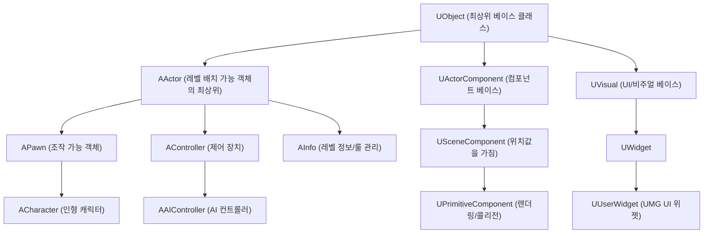

# 언리얼 엔진 클래스 상속 계층 구조 및 Blueprint 생성 범위 정리

이 문서는 언리얼 엔진(Unreal Engine)의 핵심 클래스 상속 계층 구조와 `UECommandForge`에서 블루프린트 생성 기능을 확장할 때 대상 범위를 결정하는 기준을 정리한 기록입니다.

---

## 1. 언리얼 엔진 핵심 클래스 상속 구조

언리얼 엔진의 모든 객체는 리플렉션 시스템(가비지 컬렉션, 직렬화 등)을 제공하는 최상위 클래스인 `UObject`로부터 시작합니다. 월드(레벨)에 배치 가능한 오브젝트의 최상위는 `AActor`이며, 컴포넌트나 UI 등은 별도의 상속 계층을 가집니다.

### 핵심 클래스 비교

| 클래스명 | 최상위 상속 | 레벨 배치 여부 | 위치값(Transform) 소유 여부 | 설명 |
| :--- | :--- | :---: | :---: | :--- |
| **`UObject`** | 최상위 조상 | X | X | 언리얼 엔진의 모든 객체 지향 시스템의 근간. 단독 배치 불가. |
| **`AActor`** | `UObject` | **O** | **O** (루트 컴포넌트 필요) | 레벨에 존재하고, 스폰 및 배치가 가능한 모든 객체의 부모. |
| **`UActorComponent`** | `UObject` | X | X (SceneComponent는 가짐) | Actor에 부착되어 특정 기능(이동, 렌더링, 콜리전 등)을 담당하는 컴포넌트. |
| **`UUserWidget`** | `UVisual` | X | X (UI 좌표계 사용) | UMG 화면 상에 렌더링되는 UI 요소들의 최상위 단위. |

---

## 2. Blueprint 생성 확장 계획(04-A)에 따른 범위 획정 사유

`UECommandForge`가 일반 블루프린트 생성(`CreateBlueprint`) 기능을 MVP 단계와 향후 확장 단계로 나누어 처리하는 구조적 배경은 아래와 같습니다.

### 1차 MVP 지원 범위: `AActor` 및 그 하위 클래스
* **이유:** `AActor`를 부모 클래스로 가지는 블루프린트들은 동일한 빌더 함수(`FKismetEditorUtilities::CreateBlueprint`)와 라이프사이클 검증 파이프라인을 온전히 공유합니다.
* **대상:** 일반 프롭(Prop), 문(Door), 트리거(Trigger) 및 향후 확장 예정인 Character, AIController 등.

### 1차 MVP 제외 및 이후 확장 범위: `AActor` 계층이 아닌 블루프린트
* **컴포넌트 (`UActorComponent`):** 
  * Actor에 장착되는 독립적 로직 단위로, 월드 스폰 및 배치 검증 프로세스가 Actor와는 근본적으로 다릅니다. 따라서 저장/검증 방식을 분리한 전용 빌더가 권장됩니다.
* **UI 위젯 (`UUserWidget`):** 
  * 에셋 클래스 자체가 일반 `UBlueprint`가 아닌 `UWidgetBlueprint`를 사용하며, 내부 UI 디자인 그래프와 슬롯 구조를 컴파일하는 파이프라인이 완전히 다릅니다.
* **애니메이션 (`UAnimInstance`):** 
  * 에셋 클래스로 `UAnimBlueprint`를 사용하고 애니메이션 그래프 및 상태 머신(State Machine)을 제어하기 위한 특수 컴파일러 모듈을 탑재해야 하므로 별도로 분리해야 합니다.

---

## 3. 요약 결론
* **월드 내 스폰/배치 관점:** `AActor`가 최상위 클래스가 맞으며, 이 범위는 1차 MVP의 범용 `CreateBlueprint`로 일관되게 생성할 수 있습니다.
* **전체 블루프린트 관점:** 컴포넌트, UI, 애니메이션 등 `AActor`를 상속하지 않는 객체군이 존재하므로, 이들은 각각의 특화된 전용 생성 빌더와 스펙을 통해 점진적으로 확장하는 것이 아키텍처 관점에서 훨씬 안전합니다.
